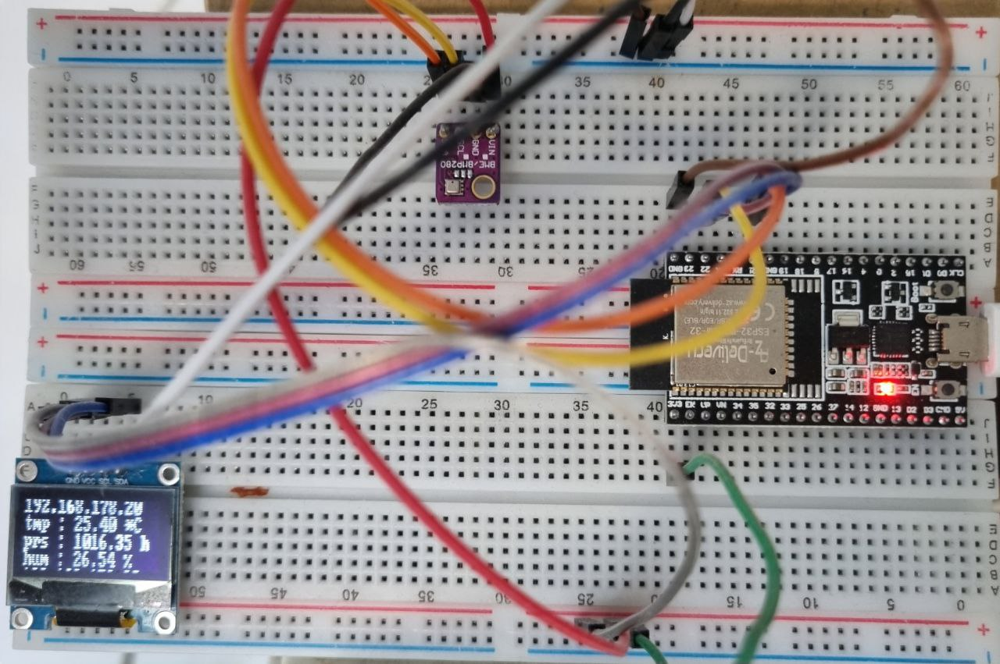

The project was based on:
https://blog.kdubovikov.ml/articles/hardware/build-yourself-a-weather-station

My device includes an 128x32 oled display and in my firmware i chose a slightly different approach.

